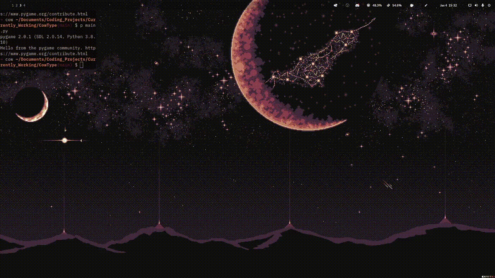

<h1 align='center'>🐮 CowType</h1>

<h4 align='center'>A minimal and simplistic app to test your typing speed.</h4>

<br>



- [Live](https://youtu.be/lXkNbTZ2OCQ) demonstration video.
- [Demo](https://replit.com/@KingCao/CowType?lite=1&outputonly=1) the Project.


<!-- ABOUT THE PROJECT -->
## About The Project

Typing is one of the only games I play nowadays. In my free time (when I'm not coding), I'm on typeracer or MonkeyType typing like a maniac. 

It gives me a sense of satisfication as well as a sliver of productivity. Therefore, I decided to take a crack on making a typing game myself. Introducing: **CowType**. A simple and minimalistic speed type tester with a colour scheme inspired by GruvBox. This lets you type for long periods of time with low strain on the eyes.

### Built With

Python3, Pygame

<!-- GETTING STARTED -->
## Getting Started

The following instructions will help you get set up locally. Don't hesitate to message me if you have any problems!

On another note, if you don't want to run this locally, try [demoing](https://replit.com/@KingCao/CowType?lite=1&outputonly=1) the project!

### Prerequisites

- [python 3](https://www.python.org/downloads/)
- The [python installer package installer](https://pip.pypa.io/en/stable/installation/): `pip` (used to install required dependencies)
```sh
python -m ensurepip --upgrade
```

### Installation

1. Clone the repo
```sh
git clone https://github.com/dave-cao/CowType.git
```
3. Install pip packages
```sh
pip install -r requirements.txt
```

<!-- USAGE EXAMPLES -->
## Usage

1. Run the application
```sh
python3 main.py
```
2. You should be presented with the following box.


3. Simply type and test your speed!

4. Exit application
```
ctl + c
# or press x button
```

_For a more comprehensive example of using this application, refer to this [video](https://youtu.be/lXkNbTZ2OCQ)_


<!-- ROADMAP -->
## Roadmap

Currently there is no future plans for this project. However, there are some things I thought of
that might be interesting to add:
1. Have the input text overlay the prompt text
2. When a word is typed incorrectly, instead of having everything turn red, make only the word turn red
3. You can't press and hold backspace, you have to press it one at a time


<!-- CONTRIBUTING -->
## Contributing

Contributions are what make the open source community such an amazing place to learn, inspire, and create. Any contributions you make are **greatly appreciated**.

If you have a suggestion that would make this better, please fork the repo and create a pull request. You can also simply open an issue with the tag "enhancement".
Don't forget to give the project a star! Thanks again!

1. Fork the Project
2. Create your Feature Branch (`git checkout -b feature/AmazingFeature`)
3. Commit your Changes (`git commit -m 'Add some AmazingFeature'`)
4. Push to the Branch (`git push origin feature/AmazingFeature`)
5. Open a Pull Request


<!-- CONTACT -->
## Contact

#### David Cao
- Email: sirdavidcao@gmail.com
- [Youtube](https://www.youtube.com/channel/UCEnBPbnNnqhQIIhW1uLXrLA)
- [Linkedin](https://www.linkedin.com/in/david-cao99/)
- Personal Website: https://davidcao.xyz/
- Project Link - https://github.com/dave-cao/CowType


